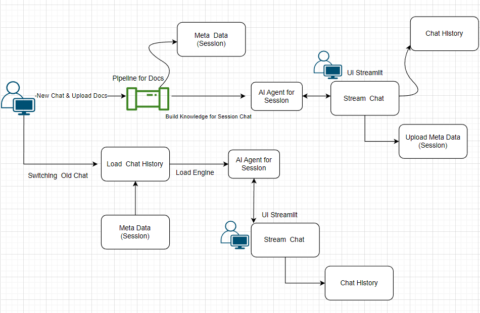
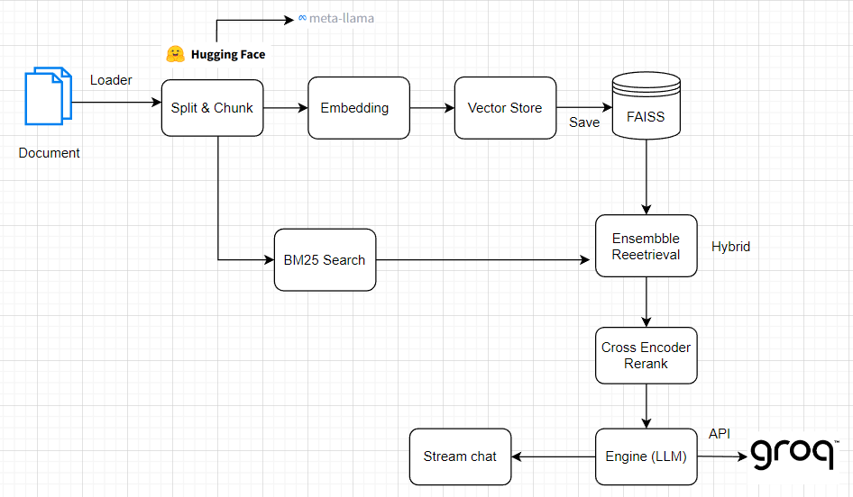

# Chat Document Analyzer 

## 🌟 Introduction
Document Analyzer is a personal project that applies the Retrieval-Augmented Generation (RAG) model to build a chatbot capable of analyzing and conversing based on the content of user-uploaded documents.
Users can upload files such as PDF, CSV and the system will:

    - Extract and process the document content.

    - Generate embeddings for semantic search and retrieval.

    - Analyze, summarize, or answer questions based on the document’s information.

    This project is developed as a non-commercial initiative to explore the integration of Large Language Models (LLMs) with user-provided data , featuring a lightweight, extensible architecture suitable for learning, experimentation, or demo purposes.

    
    

## Project Structure


    ```

    chat-document-analyzer/
    ├── .streamlit/              # Streamlit  configuration
    ├── .venv/                   # Virtual environment
    │
    ├── app/                     # Main application package
    │   ├── core/                # Core logic (chunking, data pipeline, retrieval, RAG, vector store)
    │   ├── handler/             # Chat and session request handlers
    │   ├── helper/              # Utilities & configs (config.py, logger.py)
    │   ├── services/            # External integrations (embedding, LLM)
    │   ├── static/              # Static assets (CSS, etc.)
    │   └── main.py              # Application entry point
    │
    ├── configs/                 # YAML-based system settings
    ├── data/                    # Data storage (sessions, uploads, temp)
    ├── interface/               # UI components and styles
    ├── log_file/                # Component-specific log directories
    ├── temp/                    # Temporary files
    │
    ├── .env                     # Environment variables (excluded from Git)
    ├── Dockerfile               # Docker build config
    ├── docker-compose.yml       # Docker Compose setup
    ├── requirements.txt         # Python dependencies
    ├── runtime.txt              # Python version
    └── README.md                # Project documentation

    ```
    ## Architecture
    ### App 
    
    ### Core Flow AI
    

## ⚙️ Features

### 🧠 RAG Pipeline
The **Retrieval-Augmented Generation (RAG) Pipeline** is the core of the system. It consists of the following stages:

1. **Document Processing & Embedding**
   - Supports uploading and processing multiple document formats (PDF, CSV)  
   - Analyzes and splits documents into optimized text chunks  
   - Uses **Sentence-Transformers** to generate high-quality embeddings  
   - Stores vector representations in **FAISS** for efficient semantic search  

2. **Advanced Retrieval System**
   - Implements a **Hybrid Retrieval** approach combining:  
     - **Dense Retrieval** using the FAISS vector store  
     - **Sparse Retrieval** using **BM25**  
   - **Re-ranking** via a **Cross-Encoder** model for improved accuracy  
   - **Weighted ensemble** of multiple retrieval strategies for balanced precision and recall  

3. **Intelligent RAG Integration**
   - Context-aware document retrieval for relevance  
   - Dynamic **prompt engineering** for optimal LLM queries  
   - Semantic chunk selection and context optimization  
   - Context compression for large documents  
   - Long-context handling through adaptive chunking  

---

### 🤖 AI Chatbot Features

1. **Chat Session Management**
   - Create and manage multiple independent chat sessions  
   - Save and restore full chat histories  
   - Delete or archive old sessions  
   - Seamlessly switch between sessions  

2. **Intelligent Document Interaction**
   - Chat and ask questions directly about document content  
   - Perform **semantic search** within uploaded files  
   - Compare information across different sections or documents  
   - Summarize and analyze document content  
   - Extract **insights** and **key points** automatically  

3. **Contextual Document Handling**
   - Maintain contextual understanding throughout the conversation  
   - Retrieve related information from multiple documents  
   - Provide references and citation sources for transparency  
